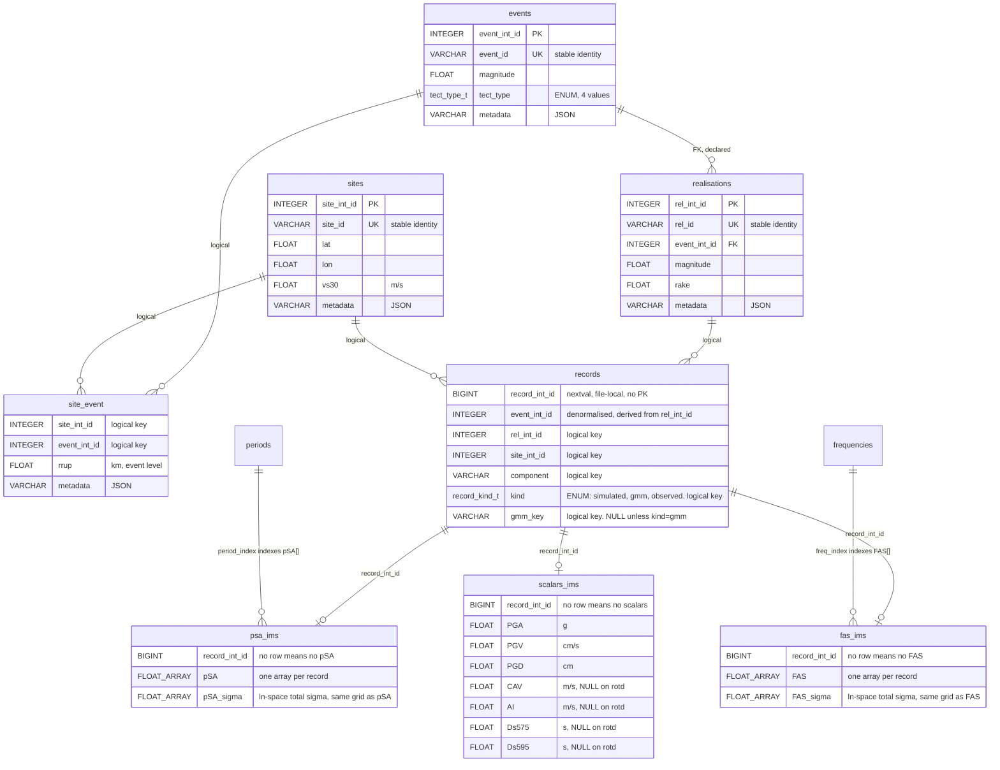

# IMDB

A library for reading and writing intensity measure databases (IMDBs), DuckDB
databases of intensity measures (IMs) from physics-based ground-motion simulation,
empirical ground-motion model (GMM) prediction, and observed ground motion.

One database per run set. Every database uses the same schema unchanged and is
self-contained. A database may mix `kind`s of record freely, distinguished per row. Schema is documented in full in `imdb/schema.py` (the single source of truth for the DDL); this README summarises it.

## Schema

Thirteen tables: four dimensions (`events`, `realisations`, `sites`, `site_event`),
one identity table (`records`), three IM tables (`psa_ims`, `fas_ims`,
`scalars_ims`), two IM vocabulary tables (`periods`, `frequencies`), and three
documentation tables (`db_meta`, `im_units`, `notes`).

A ground motion is identified by `(rel_id, site_id, component, kind, gmm_key)`.
Response spectra and Fourier spectra are stored as one array per record; scalar IMs
as named columns. Every IM column has a paired `<IM>_sigma` column/array (ln-space
total standard deviation), populated for `kind = "gmm"` records and NULL for
`"simulated"`/`"observed"`.



*(`db_meta`, `notes`, `im_units`, `periods` and `frequencies` are omitted from the
diagram above for space; see `imdb/schema.py` for the full DDL, including the
`_sigma` column on every scalar IM.)*

### Key conventions

- **Identity**: `event_id`, `rel_id` and `site_id` are stable. The integer
  surrogates (`event_int_id`, `rel_int_id`, `site_int_id`, `record_int_id`) are
  assigned at ingest and change on rebuild; nothing outside the database may
  reference them.
- **Array indexing is 1-based**: `periods.period_index` and `frequencies.freq_index`
  match DuckDB list indexing, so `pSA[period_index]` and `FAS[freq_index]` need no
  offset.
- **IM coverage is row presence**: a record has at most one row in each of
  `psa_ims`, `fas_ims` and `scalars_ims`. A missing row means that IM type is not
  held for that record, not NULL.
- **Components**: `000`, `090`, `ver`, `geom`, `rotd0`, `rotd50`, `rotd100`. A
  database may hold any subset, listed in `db_meta.components`; the writer
  validates against it. `scalars_ims.CAV`, `AI`, `Ds575` and `Ds595` are NULL for
  `rotd*` components; `PGA`, `PGV` and `PGD` are populated for every component.
- **Record kind**: `simulated` (physics-based simulation), `gmm` (empirical GMM
  prediction) or `observed` (recorded ground motion). `gmm_key` identifies the
  model, e.g. `"Bradley_2013"`, and is NULL unless `kind = "gmm"`.
- **Units**: linear, physical units; log is a read-time transform (`g` for pSA/PGA,
  `cm/s` for PGV, `cm` for PGD, `m/s` for CAV/AI, `s` for Ds575/Ds595, see
  `im_units`). Every `_sigma` column/array is the exception: ln-space total
  standard deviation, dimensionless.
- **Constraints**: `PRIMARY KEY`/`UNIQUE`/`FOREIGN KEY` appear only on the four
  dimension tables. The large tables (`site_event`, `records`, `psa_ims`,
  `fas_ims`, `scalars_ims`) have none; their logical keys are documented in
  `notes` and enforced by the writer, not the schema.

## Usage

```python
from imdb import IMDB

# read
with IMDB("run_set.duckdb") as db:
    records = db.get_records(event_ids=["event1"], component="rotd50")
    psa = db.get_psa(periods=[0.1, 1.0], event_ids=["event1"])
    scalars = db.get_scalars(ims=["PGA", "PGV"])

# write
db = IMDB.create("new.duckdb", periods=[0.1, 0.2, 1.0])
db.add_events(events_df)
db.add_realisations(realisations_df)
db.add_sites(sites_df)
db.add_site_event(site_event_df)
db.add_records(records_df)  # rel_id, site_id, component, kind, pSA, FAS, scalar IM columns
db.validate()
db.close()
```

## Development

```
uv sync --all-groups
uv run pytest -q
uv run ruff check
uv run ruff format
uv run ty check
```
